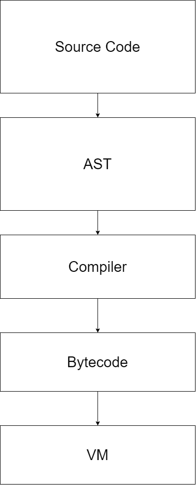

# MiniImp

This project is not meant to be usefull but more like learning experience

MiniImp is a simple intepreted programming langauge program code
is first parsed using pest which is PEG grammar parser
library. Grammar for the language can be found from
"grammar.pest" file. The core is first parsed using the parser
and then compiled to bytecode which is executed by the virtual machine.

## Usage

```bash
# Executes program normally
miniimp ./examples/smilyface.mi

# Disassembles the bytecode
miniimp dis ./examples/smilyface.mi

# Executes program but shows more log
miniimp ./examples/smilyface.mi --verbose

```

## Building

In case you wish top compile this project yourself
it can be done pretty much just with gargo build 
command but you need to make sure you have SDL2
library installed in your computer. 

Instructions for installing SDL2 can be found
from
https://github.com/Rust-SDL2/rust-sdl2

## Architecture



### Bytecode

**Load**

Loads value pointed by arg to top of the stack.

**Store**

Pops top of the stack and stores it to value pointed by arg.

**LoadConst**


**BinMul**

Pops TOS and TOS1 multiplies them and pushes to the stack. 

**BinAdd**

Pops TOS and TOS1 adds them and pushes the result to stack.

**BinMinus**

Pops TOS and TOS1 subtracts them and pushes the result to stack.

**BinDivide**

Pops TOS and TOS1 divides them and pushes the result to stack.

**Jump**

Sets instruction pointer value to arg value.

**JumpIfFalse**

Pops top of the stack and if the value is truthy then continues otherwise
sets intruction pointer value to arg.

**Call**

Pops as many values from stack as arg value and then attemps to call with 
next stack value.

**CmpEq**

Pops TOS and TOS1 and compares them acording to the arg operator
and then pushes result to stack.


## Langauge reference

Supported statements

* `while`
* `if`
* `set`
* `var`
* `call`

### while

```c
while_stmt = { "while" ~ expr ~ scope }

// Infinite loop
while true begin 
    print("Hello world")
end.

```

### if

```basic
if_stmt = { "if" ~ expr ~ "then" ~ stmts? ~ "end." }

// 
if 5 < 10 then

end.
```

### set

```js
set_stmt = { "set" ~ identifier ~ "=" ~ expr ~ ";" }

var x = 5;
```

### var

```js
var_stmt = { "var" ~ identifier ~ ("=" ~ expr)? ~ ";" }

set x = 10;
```

### calls

```js
call_stmt = { expr ~ "(" ~ arg* ~ ")" ~ ";" }

color = "black" | 
    "white" |
    "red" |
    "green" |
    "blue" |
    "yellow" |
    "magenta" |
    "cyan"

// Prints hello world to console
print("Hello world")

// Sleeps for 2500 milliseconds
sleep(2500)

// Draws line to window
line(x, y, x2, y2, color);

// Draws rectangle to window
rectangle(x, y, width, height, color)

// Draws circle to window
circle(x, y, r, color)

// Clears all drawings
clear()
```